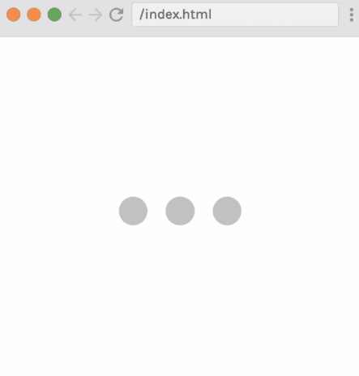

# 🎨 CSS Wizardry: 25 Epic Challenges 🚀

Welcome to my CSS playground! 🎉 This repo is a wild ride through 25 mind-bending CSS challenges that pushed my skills to the limit. From flexbox acrobatics to grid gymnastics, I've bent pixels to my will and emerged victorious! 💪

## 🌟 What's Inside?

Prepare to be dazzled by:
- 🔥 Sizzling hover effects
- 🌈 Color gradients that'll make your eyes pop
- 🎭 Shape-shifting layouts
- 🌊 Smooth-as-butter animations
- 📱 Responsive designs that'll make any device swoon

## 🏆 Challenge Source

These awesome challenges are sourced from Scrimba's CSS Challenges course. You can find the original challenges here:

<a href="https://v2.scrimba.com/css-challenges-c02p" target="_blank">Scrimba CSS Challenges</a>

I've taken on each of these challenges to sharpen my CSS skills and showcase my ability to transform designs into code. While the challenges come from Scrimba, the implementations here are my own work.

## 🚀 Launch Sequence

1. Clone this bad boy: `git clone https://github.com/your-username/your-repo-name.git`
2. Navigate to your challenge of choice
3. Open `index.html` and watch the magic unfold in your browser!

## 🗂 Index of Challenges

1. [Challenge 01: Spoiler Revealer](#challenge-01-spoiler-revealer)
2. [Challenge 02: Colorful Button](#challenge-02-colorful-button)
3. [Challenge 03: Expanding Search Bar](#challenge-03-expanding-search-bar)
4. [Challenge 04: Codepen Tile](#challenge-04-codepen-tile)
5. [Challenge 05: Loading Animation 1](#challenge-05-loading-animation-1)
6. [Challenge 06: Loading Animation 2](#challenge-06-loading-animation-2)
7. [Challenge 07: Archery Target 1](#challenge-07-archery-target-1)
8. [Challenge 08: Word Carousel](#challenge-08-word-carousel)
9. [Challenge 09: Flag of France](#challenge-09-flag-of-france)
10. [Challenge 10: Flag of Germany](#challenge-10-flag-of-germany)
11. [Challenge 11: Flag of Madagascar](#challenge-11-flag-of-madagascar)
12. [Challenge 12: Flag of Switzerland](#challenge-12-flag-of-switzerland)
13. [Challenge 13: Flag of Japan](#challenge-13-flag-of-japan)
14. [Challenge 14: Flag of Sweden](#challenge-14-flag-of-sweden)
15. [Challenge 15: Flag of Niger](#challenge-15-flag-of-niger)
16. [Challenge 16: Github Profile Layout](#challenge-16-github-profile-layout)
17. [Challenge 17: Toggle Switch](#challenge-17-toggle-switch)
18. [Challenge 18: Playing Card - Ace of Spades](#challenge-18-playing-card---ace-of-spades)
19. [Challenge 19: Playing Card - 4 of Hearts](#challenge-19-playing-card---4-of-hearts)
20. [Challenge 20: Adjustable Progress Bar](#challenge-20-adjustable-progress-bar)
21. [Challenge 21: Jeopardy Flashcard](#challenge-21-jeopardy-flashcard)
22. [Challenge 22: Loading Animation 3](#challenge-22-loading-animation-3)
23. [Challenge 23: Instagram Stories Menu](#challenge-23-instagram-stories-menu)
24. [Challenge 24: Animated Progress Bar](#challenge-24-animated-progress-bar)
25. [Challenge 25: Github Contributions Graph](#challenge-25-github-contributions-graph)

## 🎬 The Showcase

### Challenge 01: Spoiler Revealer

Engage users with an interactive spoiler revealer that unveils hidden content with style.

[🔍 Uncover the Secret](ch01)

### Challenge 02: Colorful Button

Add a splash of color to your UI with this vibrant, animated button that responds to user interactions.

[🔍 Explore the Palette](ch02)

### Challenge 03: Expanding Search Bar

Enhance user experience with a sleek, expanding search bar that smoothly animates into view.

[🔍 Magnify the Code](ch03)

### Challenge 04: Codepen Tile

Recreate the iconic Codepen tile with pure CSS, showcasing attention to detail and design fidelity.

[🔍 Pen the Details](ch04)

### Challenge 05: Loading Animation 1

Keep users engaged during load times with this hypnotic, customizable loading animation.

[🔍 Spin through the Code](ch05)

### Challenge 06: Loading Animation 2

Another take on loading animations, offering a different style to suit various design needs.

[🔍 Load up the Style](ch06)

### Challenge 07: Archery Target 1

Hit the bullseye with this CSS-crafted archery target, demonstrating precise shape creation and positioning.

[🔍 Aim for Perfection](ch07)

### Challenge 08: Word Carousel

Bring your text to life with this dynamic word carousel, perfect for showcasing multiple messages in a compact space.

[🔍 Rotate through Words](ch08)

### Challenge 09: Flag of France

Recreate the French flag using CSS, demonstrating layout skills and attention to detail in color and proportions.

[🔍 Wave the Tricolore](ch09)

### Challenge 10: Flag of Germany

Craft the German flag with CSS, showcasing precise color use and layout techniques.

[🔍 Raise the Flag](ch10)

### Challenge 11: Flag of Madagascar

Replicate Madagascar's unique flag design, demonstrating advanced CSS layout and color manipulation.

[🔍 Explore the Island](ch11)

### Challenge 12: Flag of Switzerland

Create the distinctive Swiss flag, showcasing skills in CSS shape creation and positioning.

[🔍 Cross into the Code](ch12)

### Challenge 13: Flag of Japan

Craft Japan's iconic flag design using CSS, demonstrating circle creation and centering techniques.

[🔍 Rise with the Sun](ch13)

### Challenge 14: Flag of Sweden

Recreate Sweden's flag, showcasing cross design implementation in CSS.

[🔍 Scan the Nordic Cross](ch14)

### Challenge 15: Flag of Niger

Design Niger's flag using CSS, demonstrating skills in creating more complex flag layouts.

[🔍 Shine on the Sahel](ch15)

### Challenge 16: Github Profile Layout

Recreate the Github profile layout, showcasing responsive design and attention to detail in UI replication.

[🔍 Clone the Profile](ch16)

### Challenge 17: Toggle Switch

Create an interactive, stylish toggle switch using pure CSS, perfect for settings or theme changes.

[🔍 Flip the Switch](ch17)

### Challenge 18: Playing Card - Ace of Spades

Craft the Ace of Spades playing card using CSS, demonstrating intricate design and layout skills.

[🔍 Deal the Code](ch18)

### Challenge 19: Playing Card - 4 of Hearts

Design the 4 of Hearts playing card, showcasing pattern creation and symmetry in CSS.

[🔍 Heart the Design](ch19)

### Challenge 20: Adjustable Progress Bar

Create an interactive, adjustable progress bar that responds to user input.

[🔍 Measure the Progress](ch20)

### Challenge 21: Jeopardy Flashcard

Recreate the iconic Jeopardy flashcard with a flip animation, perfect for quiz applications.

[🔍 Question the Code](ch21)

### Challenge 22: Loading Animation 3

A third variation on loading animations, offering yet another style for diverse application needs.

[🔍 Animate the Wait](ch22)

### Challenge 23: Instagram Stories Menu

Replicate Instagram's stories menu, demonstrating skills in creating modern, app-like interfaces with CSS.

[🔍 Story of the Code](ch23)

### Challenge 24: Animated Progress Bar

Design a smoothly animated progress bar, perfect for displaying download or upload progress.

[🔍 Progress through the Code](ch24)

### Challenge 25: Github Contributions Graph

Recreate Github's contributions graph, showcasing data visualization skills with CSS.

[🔍 Commit to the Challenge](ch25)

## 🧠 Brain Gains

This journey taught me more than I ever imagined about the dark arts of CSS. I've battled browser inconsistencies, conquered cascade conundrums, and emerged a CSS sorcerer! 🧙‍♂️

## 🙏 Final Thoughts

Remember, in the world of CSS, creativity is your only limit. So go forth, bend those pixels, and create something awesome! And hey, if these challenges inspired you, why not give them a shot yourself? (and give me a star😉)

Keep coding, keep creating, and most importantly, keep having fun! 🎉
